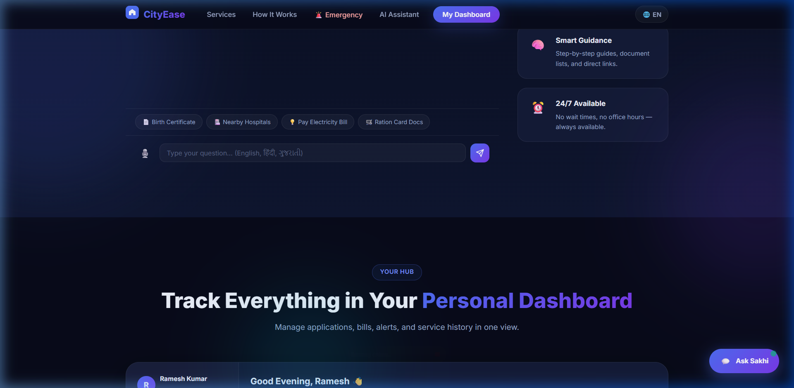

# 🏙️ CityEase — Urban Services Platform

> A centralized, multilingual full-stack platform that simplifies access to essential urban services for every Indian citizen.



---

## ✨ Features

| Feature | Description |
|---|---|
| 🔍 **Smart Search** | Natural-language search with real-time suggestions and voice input |
| 🤖 **AI Chatbot (Sakhi)** | English, Hindi & Gujarati support — step-by-step guidance |
| 📋 **Service Guides** | Documents, cost, time, and steps for 10+ urban services |
| 💳 **Bill Payments** | Pay electricity, water, and gas bills — persisted in SQLite |
| 📊 **Personal Dashboard** | Application tracking, reminders, and live transit — all live from API |
| 🚌 **Live Transit** | Real-time bus/metro arrival times that refresh every 30s |
| 🏥 **Nearby Services** | Filterable map of hospitals, offices, and utility centers |
| 🚨 **Emergency Access** | One-tap calling for police, ambulance, fire — multilingual names |
| 🌐 **3 Languages** | Full EN / हिंदी / ગુજરાતી UI switching via API |
| ♿ **Accessible** | WCAG 2.1 AA — ARIA labels, keyboard nav, screen-reader friendly |

---

## 🛠️ Tech Stack

| Layer | Technology |
|---|---|
| **Frontend** | React 18, Vite, React Router v6, Axios |
| **Backend** | Express.js, Node.js |
| **Database** | SQLite via `better-sqlite3` (zero-config) |
| **Styling** | Vanilla CSS with CSS Custom Properties |
| **Languages** | English, Hindi (हिंदी), Gujarati (ગુજરાતી) |

---

## 📁 Project Structure

```
CityEase/
├── client/                  # React frontend (Vite)
│   ├── src/
│   │   ├── components/      # Navbar, SearchBar, Dashboard, Chatbot, etc.
│   │   ├── contexts/        # LangContext (i18n), UserContext (toast/user)
│   │   ├── pages/           # Home, ServiceDetail, SearchResults
│   │   ├── styles/          # index.css (single global stylesheet)
│   │   └── utils/           # helpers.js (debounce, formatters)
│   └── index.html
│
├── server/                  # Express backend
│   ├── routes/              # services, search, chat, bills, transit, etc.
│   ├── data/
│   │   ├── services.json    # All service definitions (multilingual)
│   │   ├── translations.json # UI strings for EN/HI/GU
│   │   └── db.js            # SQLite setup + seed data
│   ├── index.js             # Server entry point
│   └── .env.example         # Environment template
│
└── package.json             # Root — runs both servers with concurrently
```

---

## 🚀 Getting Started

### Prerequisites
- Node.js >= 18
- npm >= 9

### 1. Clone & Install

```bash
git clone https://github.com/YOUR_USERNAME/cityease.git
cd cityease
npm run install:all
```

### 2. Configure Environment

```bash
cp server/.env.example server/.env
# Edit server/.env if needed (default port is 3001)
```

### 3. Run in Development

```bash
npm run dev
```

This starts both:
- **API Server** → `http://localhost:3001`
- **React App** → `http://localhost:5173`

---

## 🏗️ Production Build

### Build the React app

```bash
npm run build
```

### Run in production (single server)

```bash
NODE_ENV=production npm start
```

The Express server will serve the React build from `client/dist/` at the same port.

---

## 🌐 API Endpoints

| Method | Endpoint | Description |
|---|---|---|
| GET | `/api/health` | Server health check |
| GET | `/api/services?lang=en` | All service listings |
| GET | `/api/services/:id?lang=en` | Single service with full steps |
| GET | `/api/search?q=query&lang=en` | Smart search |
| POST | `/api/chat` | AI chatbot (body: `{message, lang}`) |
| GET | `/api/transit` | Live transit arrival times |
| GET | `/api/bills` | User's bills |
| POST | `/api/bills/:id/pay` | Pay a specific bill |
| GET | `/api/applications` | User's applications |
| POST | `/api/applications` | Create new application |
| GET | `/api/nearby?filter=all` | Nearby services |
| GET | `/api/emergency?lang=en` | Emergency contacts |
| GET | `/api/translations/:lang` | UI translation strings |

---

## 📦 Deploying

### Render / Railway / Fly.io
1. Set `NODE_ENV=production`
2. Set build command: `npm run install:all && npm run build`
3. Set start command: `NODE_ENV=production npm start`

### Vercel
- Deploy `client/` as a Vite static app
- Deploy `server/` as a separate Node.js service
- Set `VITE_API_URL` to the server URL

---

## 📱 Screenshots

| Hero | Services | Dashboard |
|---|---|---|
| Smart search, voice, stats | 10+ service cards with filters | Bills, transit, applications live |

---

## 🤝 Contributing

1. Fork the repo
2. Create a feature branch: `git checkout -b feature/my-feature`
3. Commit your changes: `git commit -m 'feat: add new feature'`
4. Push: `git push origin feature/my-feature`
5. Open a Pull Request

---

## 📄 License

MIT © 2026 CityEase — A Smart City Initiative

---

> Built for the **Smart Cities Mission** · Supports **Digital India** · WCAG 2.1 AA Accessible
